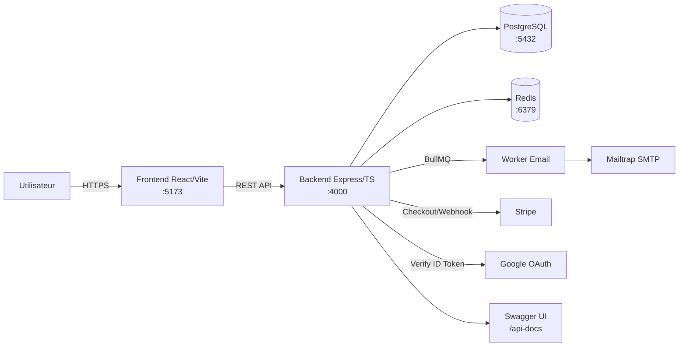
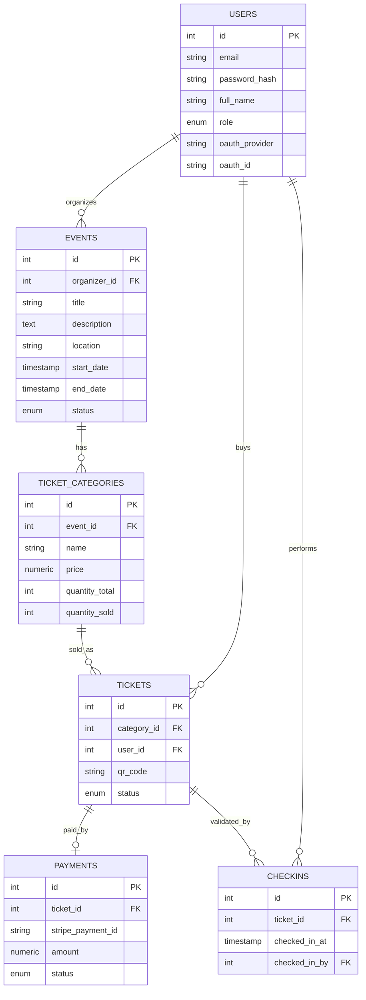

# EventFlow

Plateforme de billetterie et gestion d'événements — Projet Final L3 Informatique (2025-2026).

## Stack

- **Backend** : Express, TypeScript, PostgreSQL, JWT, BullMQ (Redis), Stripe, Nodemailer
- **Frontend** : React (Vite), React Router, Axios
- **Infrastructure** : Docker, Docker Compose, GitHub Actions (CI)

## Rôles

- **Participant** : achète des billets, reçoit son billet par email avec QR code
- **Organisateur** : crée des événements, gère les catégories de billets, scanne les billets à l'entrée, consulte les statistiques
- **Administrateur** : supervision globale

## Installation

### Prérequis
- Docker Desktop
- Node.js 20+ (pour développement hors Docker)

### Étapes

1. Cloner le dépôt :
```bash
git clone https://github.com/fiderana30215/eventflow.git
cd eventflow
```

2. Copier les fichiers d'environnement :
```bash
cp .env.example .env
cp backend/.env.example backend/.env
```

3. Remplir `backend/.env` avec vos clés Stripe (test) et identifiants Mailtrap.

4. Lancer l'application :
```bash
docker compose up --build
```

5. Initialiser la base de données (première fois) :
```bash
docker exec -i eventflow-db psql -U eventflow -d eventflow_db < schema.sql
```

6. Accéder à l'application :
   - Frontend : http://localhost:5173
   - Backend API : http://localhost:4000
   - Health check : http://localhost:4000/health

## Comptes de test

À créer via `/api/auth/register` :
| Rôle | Email | Mot de passe |
|---|---|---|
| Participant | participant@test.com | test1234 |
| Organisateur | organizer@test.com | test1234 |

## Structure du projet

```
eventflow/
├── backend/          # API Express (TypeScript)
│   └── src/
│       ├── config/       # DB, Redis, Swagger
│       ├── middleware/   # Auth JWT
│       ├── routes/       # auth, oauth, events, tickets, checkins, payments
│       ├── services/     # email, QR code
│       └── queues/       # file d'attente BullMQ
├── frontend/         # React (Vite)
│   └── src/
│       ├── api/
│       ├── context/
│       ├── components/   # GoogleLoginButton
│       └── pages/        # Events, EventDetail, CreateEvent, EventManage,
│                          # MyEvents, Scan, Login, Register
├── docker-compose.yml
├── schema.sql
├── EventFlow.postman_collection.json
└── .github/workflows/ci.yml
```

## Fonctionnalités

- [x] Architecture client-serveur (API REST documentée)
- [x] Authentification JWT (inscription, connexion, rôles)
- [x] OAuth Google
- [x] Paiement Stripe (checkout + webhook)
- [x] Envoi d'emails transactionnels (Mailtrap)
- [x] Tâches asynchrones (file BullMQ pour les emails)
- [x] Conteneurisation Docker (backend, frontend, db, redis)
- [x] CI (lint + build + Docker build) — pipeline vert sur GitHub Actions
- [ ] CD (bonus, à configurer si serveur disponible)
- [x] Sécurité de base (helmet, rate limiting, requêtes préparées, .env, bcrypt)
- [x] Documentation API interactive (Swagger UI sur /api-docs)

## API — Endpoints principaux

| Méthode | Route | Description | Auth |
|---|---|---|---|
| POST | /api/auth/register | Inscription | - |
| POST | /api/auth/login | Connexion | - |
| GET | /api/events | Liste des événements publiés | - |
| GET | /api/events/mine | Mes événements (tous statuts) | Organisateur |
| GET | /api/events/:id | Détail événement | - |
| POST | /api/events | Créer un événement | Organisateur |
| PATCH | /api/events/:id/publish | Publier un événement | Organisateur |
| POST | /api/events/:id/categories | Ajouter catégorie de billets | Organisateur |
| GET | /api/events/:id/stats | Statistiques événement | Organisateur |
| POST | /api/auth/google | Connexion via Google OAuth | - |
| POST | /api/payments/checkout | Créer session paiement Stripe | Participant |
| POST | /api/payments/webhook | Webhook Stripe | - |
| GET | /api/tickets/my | Mes billets | Participant |
| POST | /api/checkins | Check-in (scan QR) | Organisateur |

Documentation interactive complète disponible sur `http://localhost:4000/api-docs` (Swagger UI).

Collection Postman : `EventFlow.postman_collection.json` à la racine du projet.

## Architecture



## Schéma de la base de données

